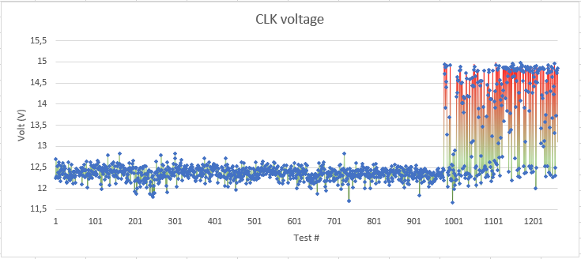

# text-from-file
Extracts a specific part of textline from multiple files of same type. Eg. one test value from multiple test reports to check long term variation.

## Example
Search from all 1200 .xml -file, find line 669 and value after "Datum value =".
Line no. 669 looks like:

```xml
						<c:Datum value = "12.49" xsi:type="ts:TS_double" nonStandardUnit="V" flags = "0x0400"/>
```

Example graph made with excel:

